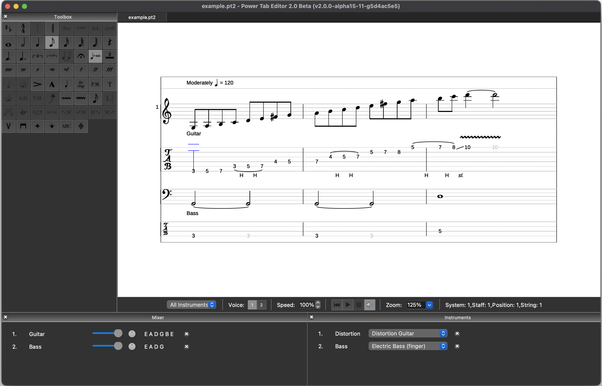

Power Tab Editor is an easy to use cross-platform guitar tablature editor and viewer.
It is an open source, community-driven successor to the original Power Tab Editor 1.7.

A variety of file formats are supported, including .pt2, .ptb, .gp3, .gp4, .gp5, .gpx, and .gp

